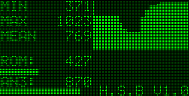

# PIC-Keypad-Driven-GLCD
PIC GLCD project with Keypad Functionality.

The project is written for the EasyPIC Development Board using the Real Pic Simulator as the development and testing platform.
The project is written in C using the MicroC IDE.

The project is a real time interface that displays Analouge inputs from the PIC board/simulation. The program allows the input
values to be stored to EEPROM (up to 3 values). It also allows you to plot a graph based on the current reading of the 
analogue input value for 64 samples.
